# Ход работы

1. Установка RabbitMQ
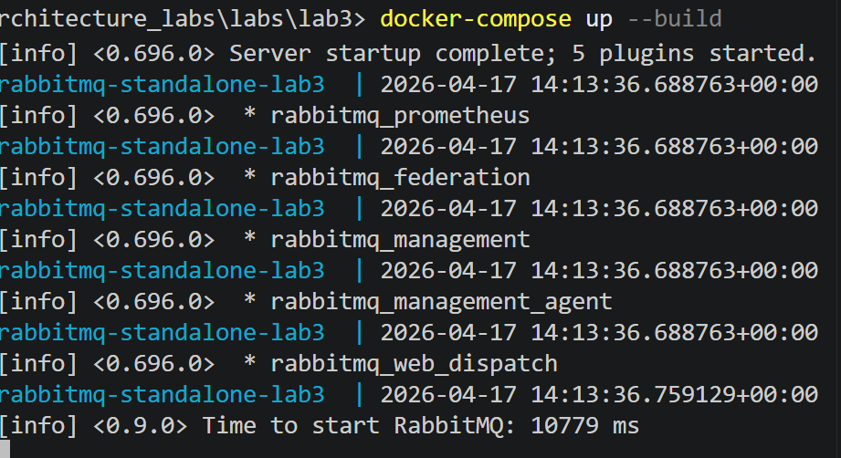
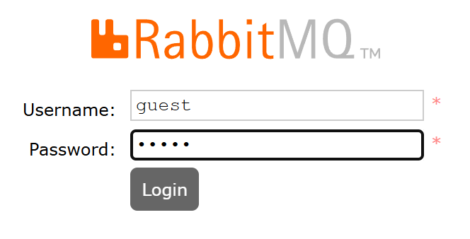

2. Создание очереди
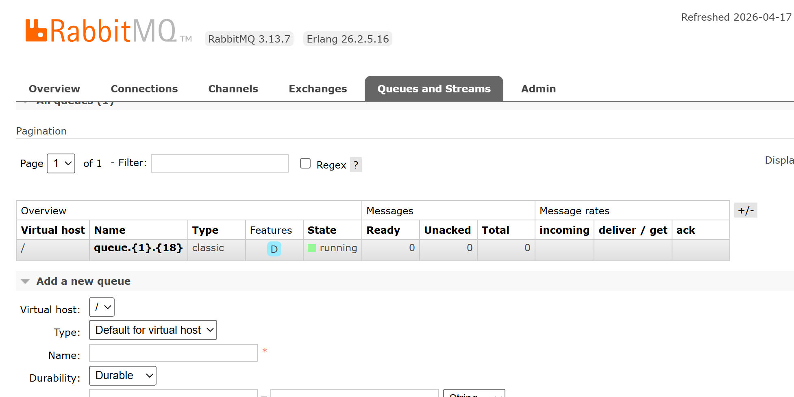

3. Создание обменника
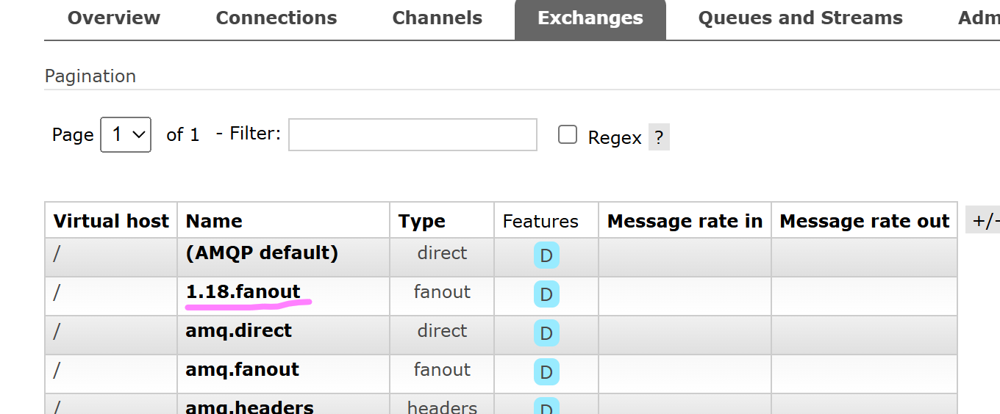

4. Связь между обменником и очередью
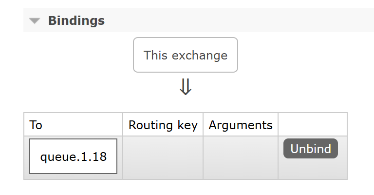

5. Сообщение с пустым и непустым routing key
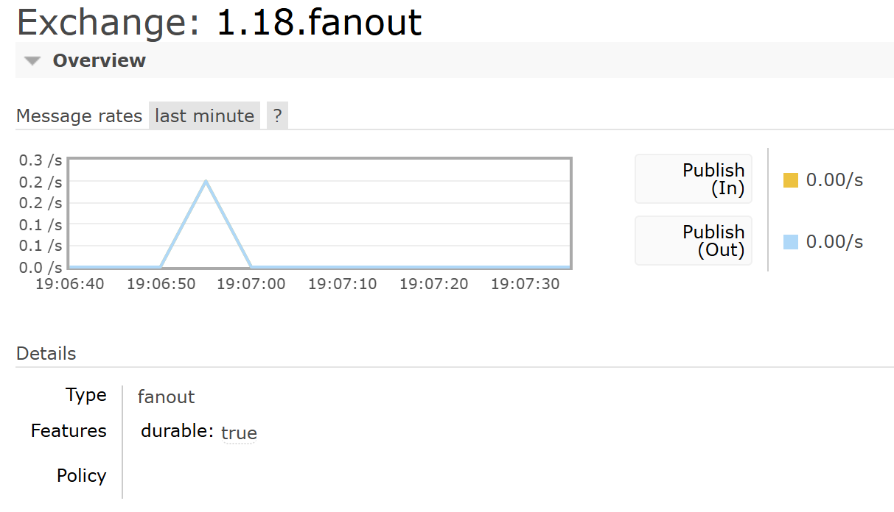
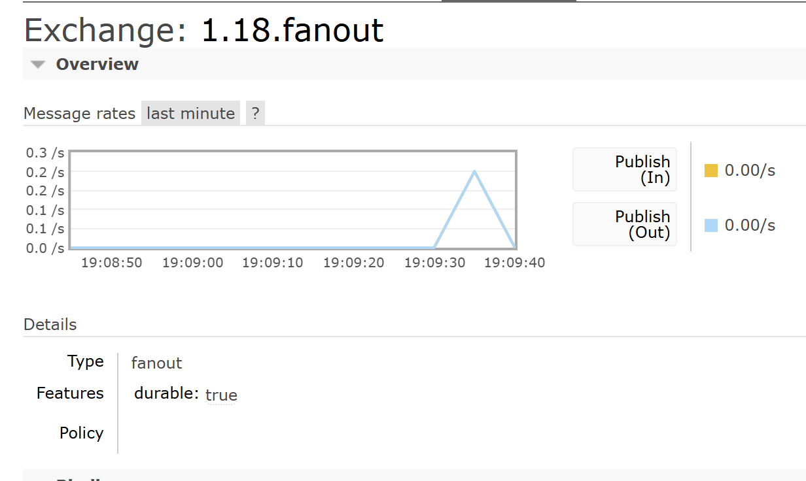
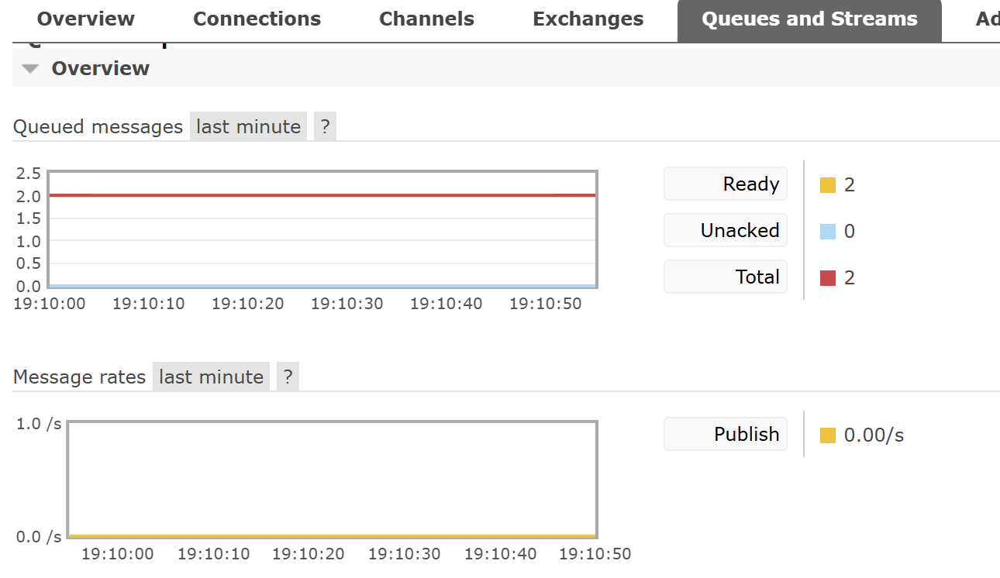

6. Создание direct обменника
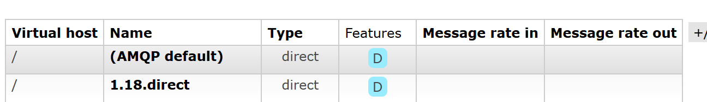
Сообщения с правильным и неправильным routing key:
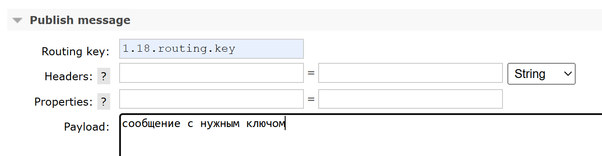
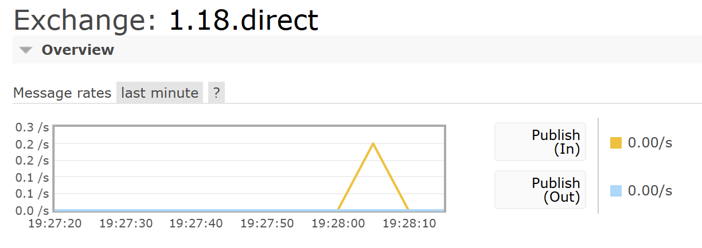

7. Topic обменник
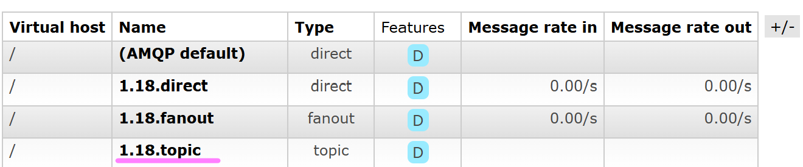
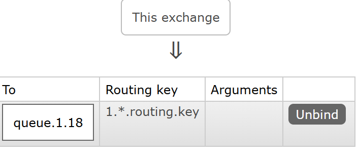
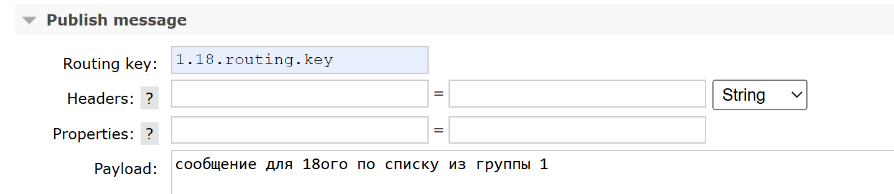
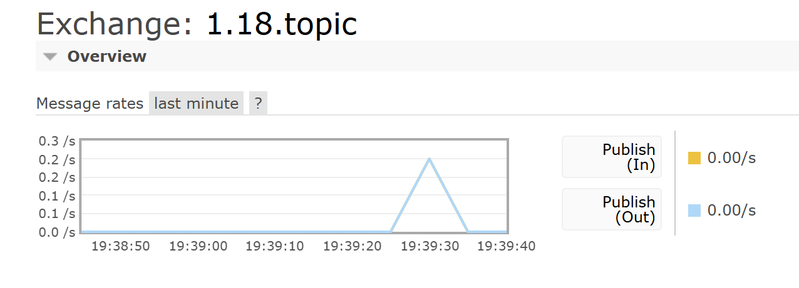
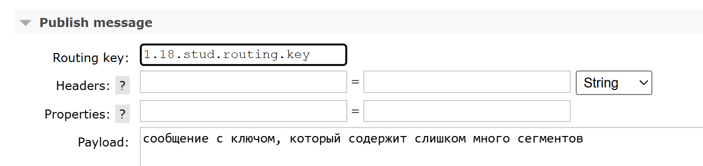
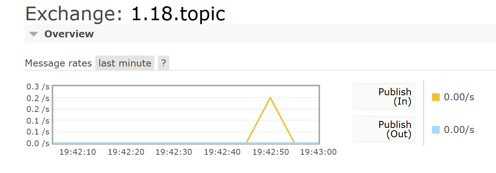

8. Headers обменник
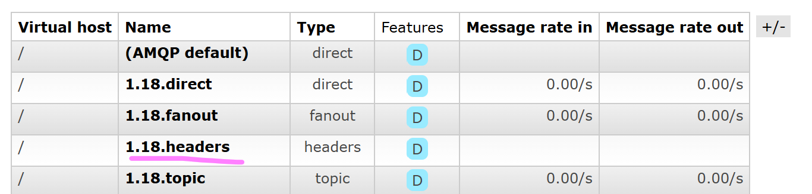
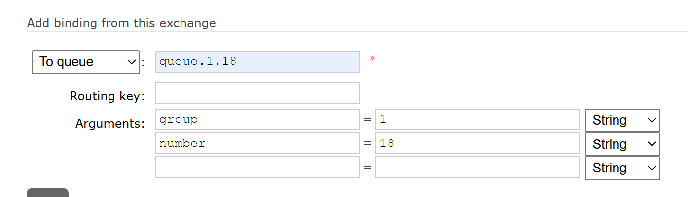
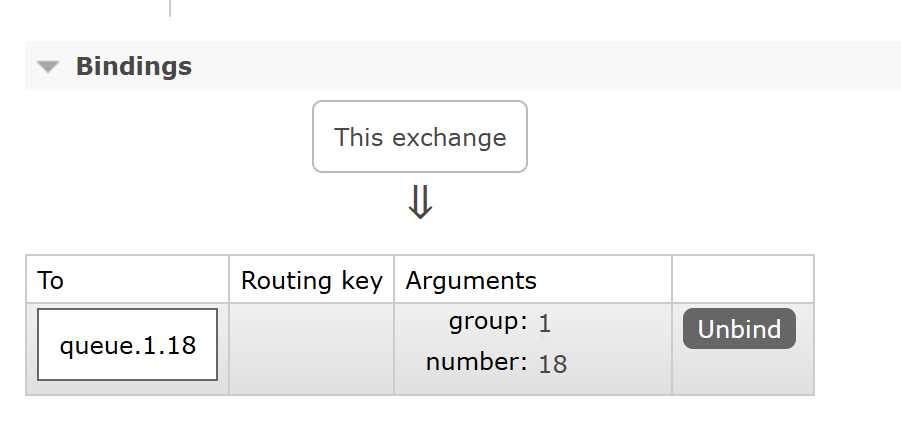
Сообщения с нужными и неправильными заголовками
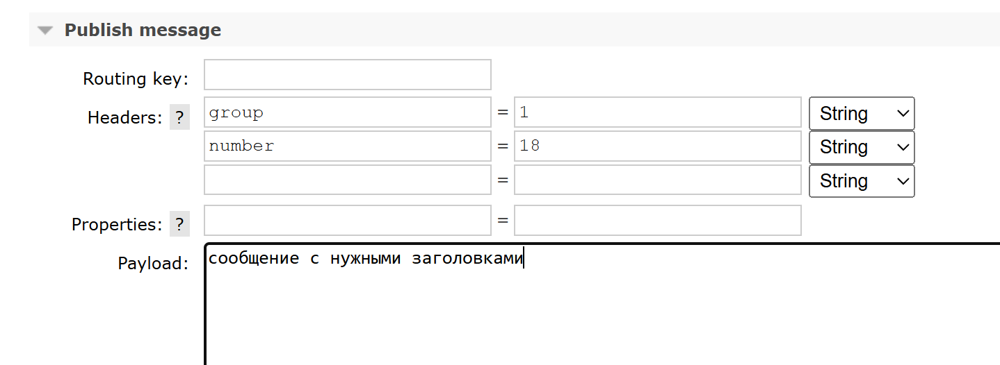
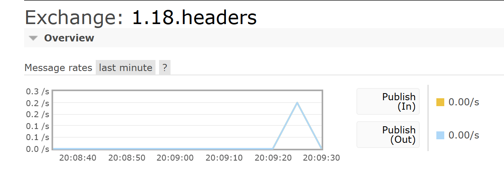
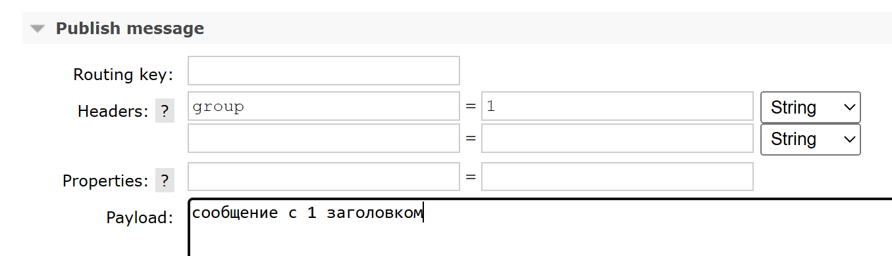
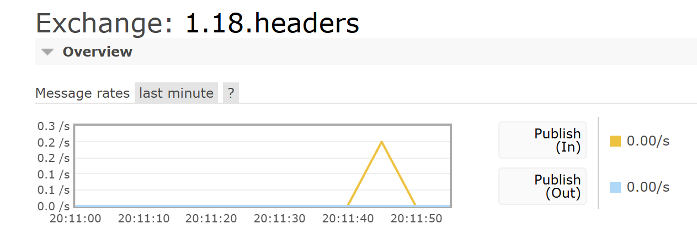