# Лабораторная работа 4

1. Список сервисов, которые опрашивает Prometheus:
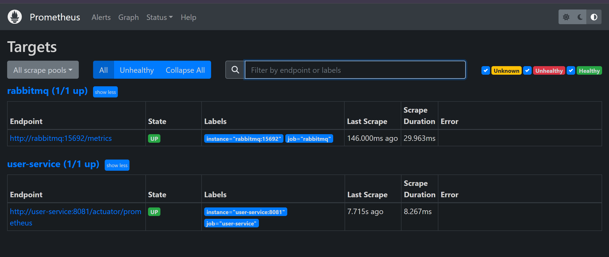

2. Дашборды Графаны:
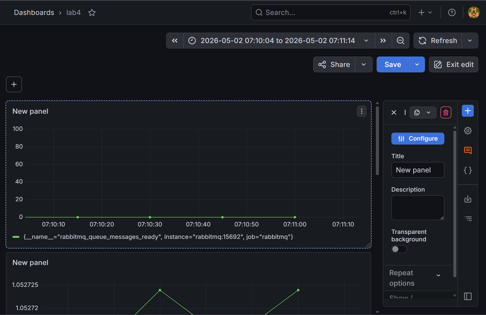
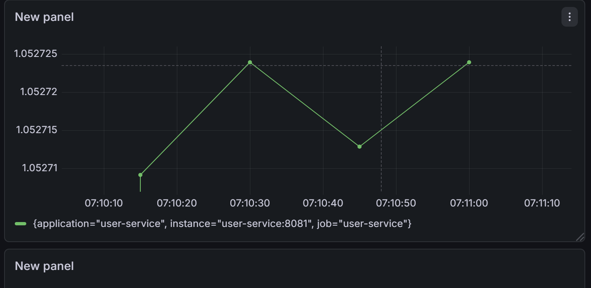
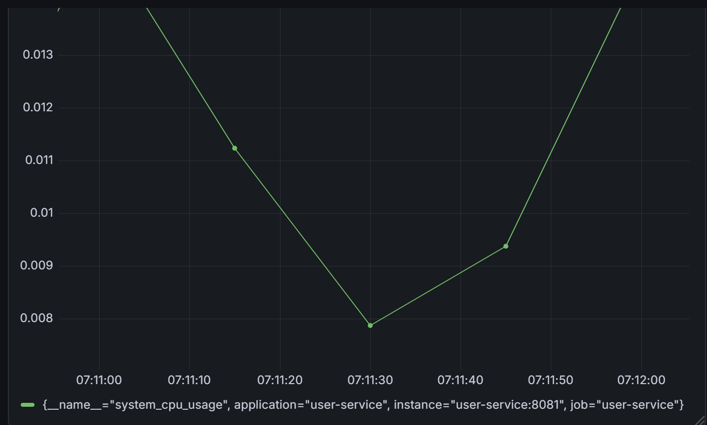
s
3. Настроенные алерты:
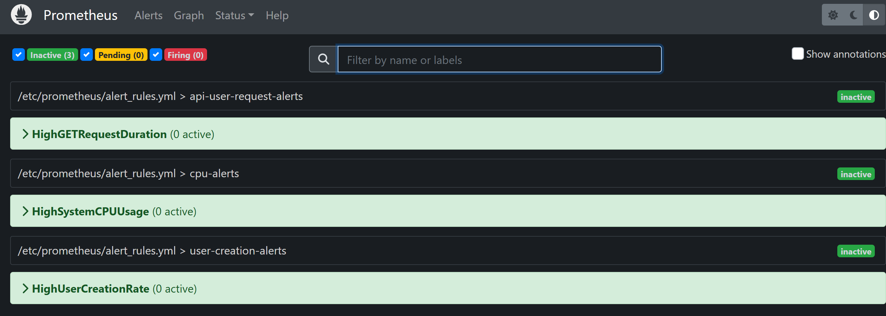

4. Конфигурация алертменеджера:
Создаем через сваггер много юзеров (>10):
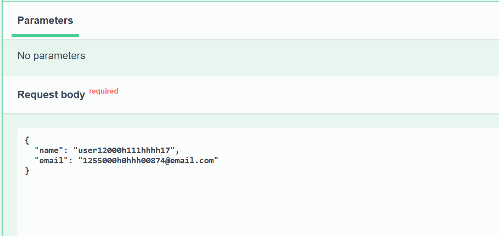

У нас появляется алерт:
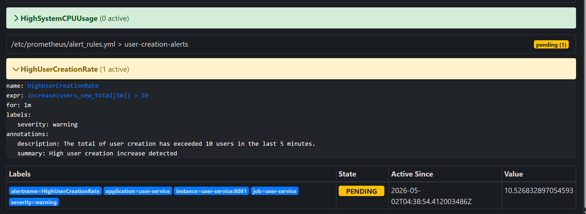

По прошествии времени он изменяет статус на Firing:
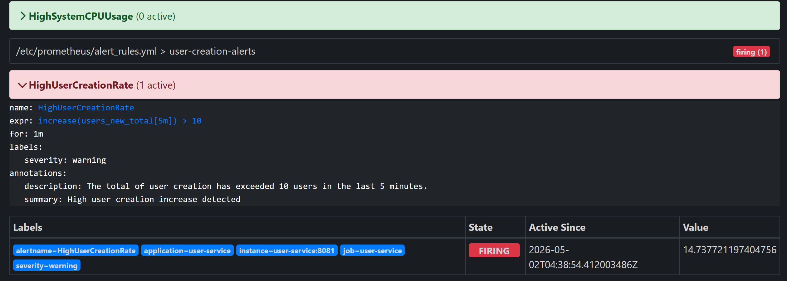

Alertmanager высылает письмо об алерте:
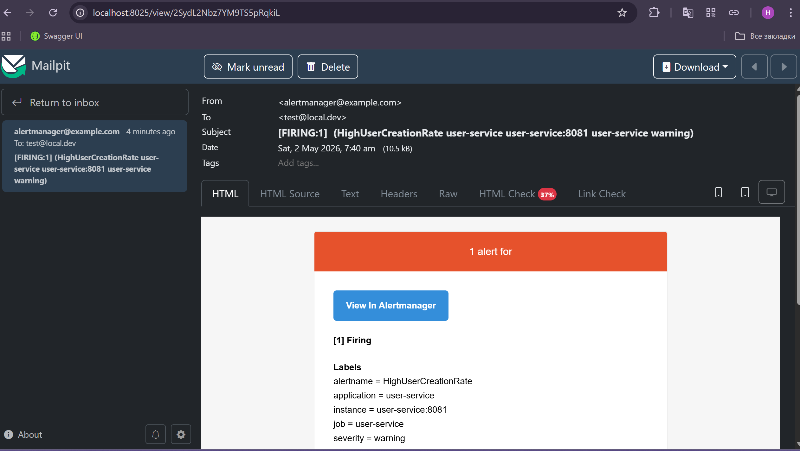

5. Метрики, которые мы отдаем:
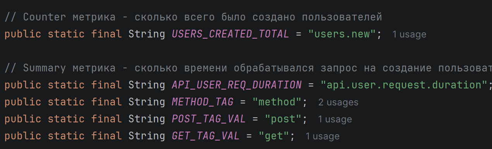
Например, создадим через сваггер нового пользователя и посмотрим на соответствующую метрику:
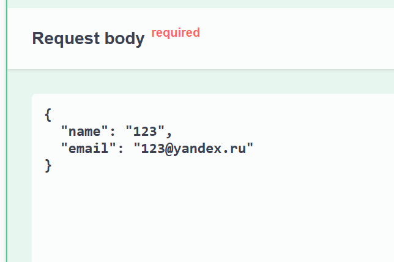
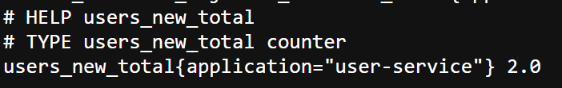
Другие метрики и запросы в консоль Prometheus:
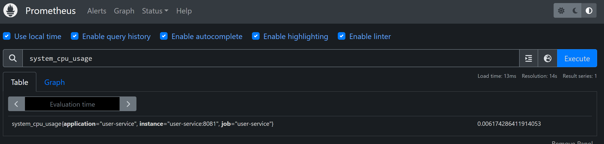
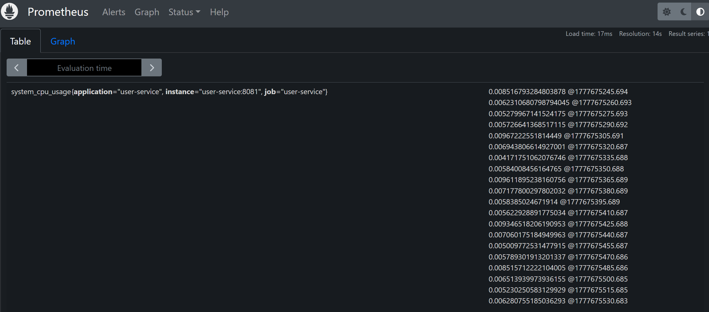
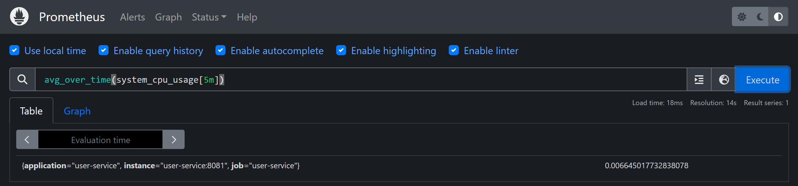